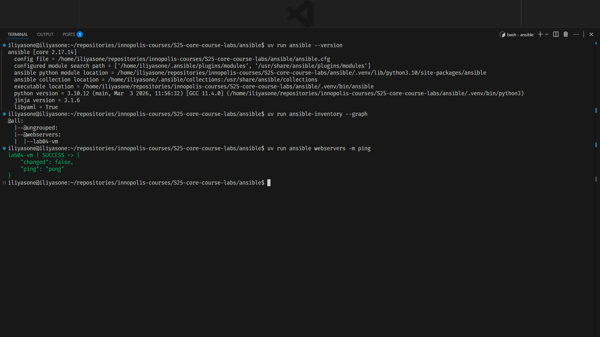
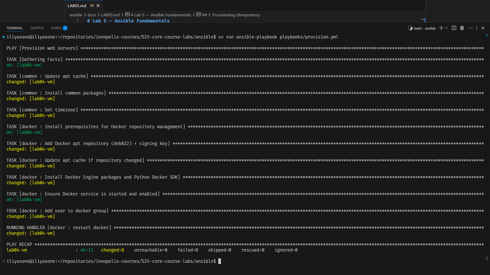
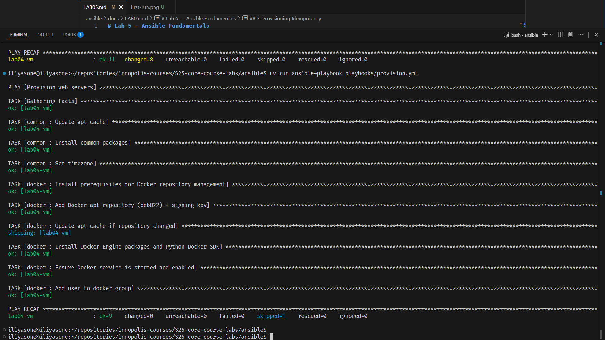
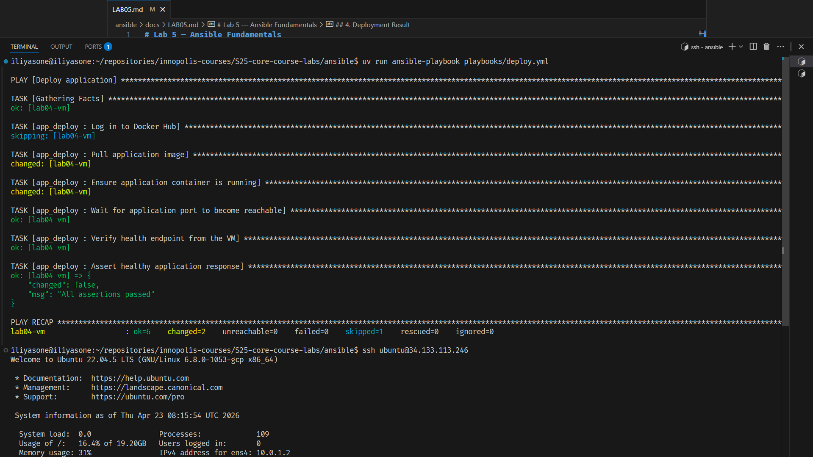
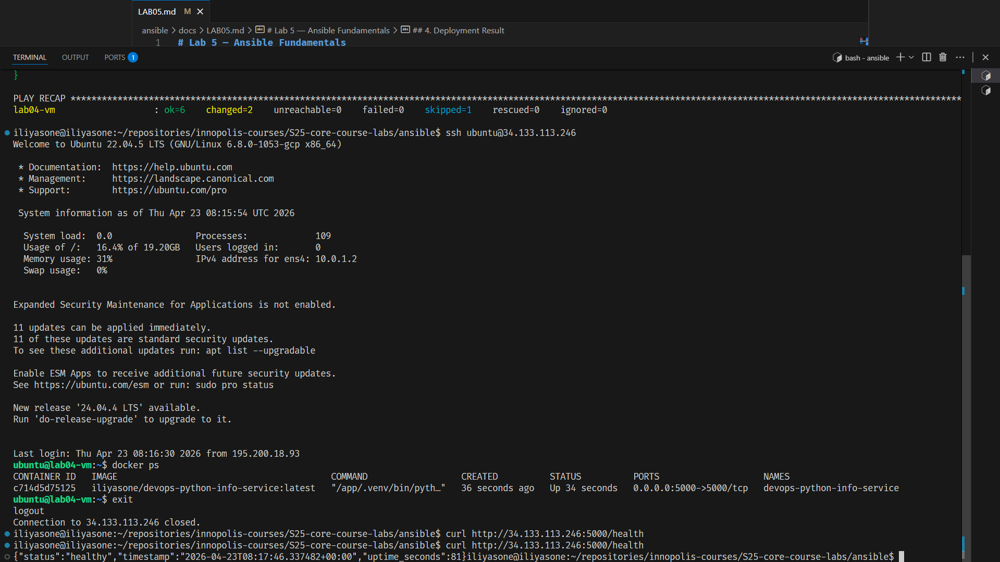

# Lab 5 — Ansible Fundamentals

## 1. Inventory & Target Host

For the main workflow I use the official Ansible GCP inventory plugin:

```text
ansible/inventory/gcp_compute.yml
```

The inventory source is intentionally committed **without** any absolute credential path.

Local authentication is provided through the environment:

```bash
cd ansible
export GCP_SERVICE_ACCOUNT_FILE="$HOME/.config/gcloud/keys/my-service-account.json"
```

Ansible here is a Python package managed by `uv` from `ansible/pyproject.toml`

```bash
uv run ansible --version
uv run ansible-inventory --graph
uv run ansible webservers -m ping
```

This avoids accidentally using the system `ansible` binary, which can fail if it does not have the required Python packages such as `google-auth`.

The plugin discovers running GCP instances from project `s25-devops-retake`, uses the instance name as inventory hostname, and composes `ansible_host` from the public NAT IP.

Observed inventory result:

```text
@all:
  |--@ungrouped:
  |--@webservers:
  |  |--lab04-vm
```



## 2. Project Structure

```text
ansible/
├── ansible.cfg
├── docs/
│   └── LAB05.md
├── group_vars/
│   └── all.yml
├── inventory/
│   ├── gcp_compute.yml
│   ├── hosts.ini
├── playbooks/
│   ├── deploy.yml
│   ├── provision.yml
│   └── site.yml
└── roles/
    ├── app_deploy/
    ├── common/
    └── docker/
```

Role summary:

- `common` — apt cache update, essential packages, timezone
- `docker` — Docker repository, packages, daemon enablement, `docker` group
- `app_deploy` — image pull, container start, port wait, health check

`site.yml` imports both `provision.yml` and `deploy.yml`, so one command applies the full host configuration.

## 3. Provisioning Idempotency

Command:

```bash
cd ansible
uv run ansible-playbook playbooks/provision.yml
```

### First run



Observed recap:

```text
lab04-vm : ok=11 changed=8 skipped=0 failed=0
```

Main tasks that changed:

- apt cache update
- common package installation
- timezone setup
- Docker repository creation
- apt cache refresh after repository change
- Docker package installation
- user added to `docker` group
- Docker handler restart

### Second run



Observed recap:

```text
lab04-vm : ok=9 changed=0 skipped=1 failed=0
```

What happened:

- all stateful tasks returned `ok`
- `Update apt cache if repository changed` was `skipped`
- no package, service, repository, or user state drift remained

This is the expected idempotent behavior.

## 4. Deployment Result

Command:

```bash
cd ansible
uv run ansible-playbook playbooks/deploy.yml
```

Observed recap:

```text
lab04-vm : ok=6 changed=2 skipped=1 failed=0
```

The Docker Hub login step was skipped intentionally because the image is public and `dockerhub_login_enabled: false`.

Container status on the VM:

```text
CONTAINER ID   IMAGE                                         COMMAND                  CREATED         STATUS              PORTS                    NAMES
14717e87bc72   iliyasone/devops-python-info-service:latest   "/app/.venv/bin/pyth…"   2 minutes ago   Up About a minute   0.0.0.0:5000->5000/tcp   devops-python-info-service
```



External verification:

```bash
curl http://34.133.113.246:5000/health
```

Response:

```json
{"status":"healthy","timestamp":"2026-04-23T08:18:26.134643+00:00","uptime_seconds":121}
```



Main endpoint verification:

```json
{
  "service": "devops-python-info-service",
  "status": "UTC",
  "endpoints": [
    "/",
    "/health"
  ]
}
```

## 5. Vault Usage

`ansible/group_vars/all.yml` is encrypted with Ansible Vault:

```text
$ANSIBLE_VAULT;1.1;AES256
...
```

What should go into the vault?

- Docker Hub access token or password
- Docker Hub username
- any future private application variables
  - database password
  - API tokens
  - secret keys

In the current setup the image is public, so the role works without registry login (`dockerhub_login_enabled: false` config which lives in `roles/app_deploy/defaults/main.yml`)
Right now the Docker Hub secret in Vault is intentionally empty, because there is nothing sensitive needed for pulls from a public repository.

Current state:
```bash
$ uv run ansible-vault view group_vars/all.yml
---
dockerhub_username: iliyasone
dockerhub_password: ""
```

Deployment still works because `iliyasone/devops-python-info-service` is public


## 6. Key Decisions

**Why roles instead of one large playbook?**  
Roles separate concerns cleanly: base OS setup, Docker installation, and application deployment all evolve independently.

**Why `google.cloud.gcp_compute` instead of a custom inventory script?**  
It is the standard Ansible solution for dynamic cloud inventory, and it can discover all currently running instances directly from GCP without any hardcoded IPs.

**What makes these tasks idempotent?**  
They declare end state with Ansible modules such as `apt`, `deb822_repository`, `service`, `user`, and `docker_container`, so reruns converge instead of redoing work.

## 7. Run Steps

```bash
cd pulumi
pulumi up

cd ../ansible
export GCP_SERVICE_ACCOUNT_FILE="$HOME/.config/gcloud/keys/my-service-account.json"
uv run ansible-inventory --graph
uv run ansible-playbook playbooks/provision.yml
uv run ansible-playbook playbooks/deploy.yml
uv run ansible-playbook playbooks/site.yml
```

If I want a completely fresh “first run” again for screenshots, the clean path is to recreate the VM from Pulumi first and then rerun the Ansible commands above.
