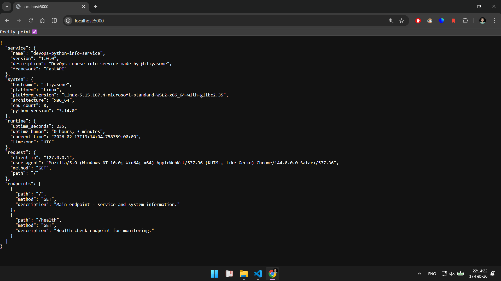
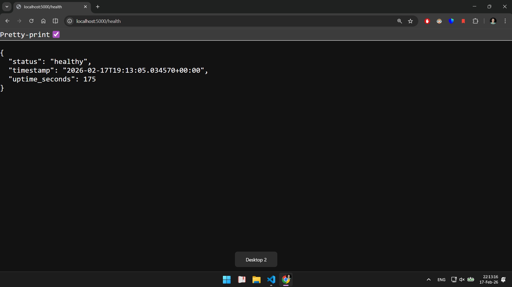
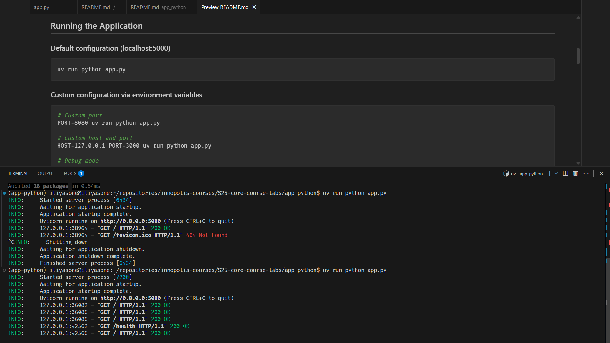

# Lab 1 — DevOps Info Service Implementation

## 1. Framework Selection & Comparison


| Framework   | Production Ready 🚀 | Type Safety 🔒 | Async Support ⚡ | Auto Documentation 📄 | Built-in ORM 🗄️ | Architecture Style 🏗️  |
| ----------- | ------------------- | -------------- | --------------- | --------------------- | ---------------- | ----------------------- |
| **Flask**   | ✅                   | ❌ (manual)     | ◑ limited       | ❌ (extensions)        | ❌                | Minimal / micro         |
| **FastAPI** | ✅                   | ✅              | ✅ (native)      | ✅ (OpenAPI)           | ❌                | Modern API / ASGI       |
| **Django**  | ✅                   | ◑ partial      | ◑ limited       | ◑ partial             | ✅                | Full-stack / monolithic |

Django seems like an overkill, we don't need built-in ORM. 

I chose FastAPI: strong typing, async execution and automatic API documentation while remaining lightweight for an API service. 


## 2. Best Practices Applied

### 1. Clean Code Organization

- **PEP 8**  
I used `ruff` from Astral for PEP 8: style checking, formatting and imports groupung.
It is "An extremely fast Python linter and code formatter, written in Rust"

- **Type Safety**  
I used `pyright` in standard type checking mode. All functions and variables have documented types. It is extremely useful for error prevention and increases writing speed.

### 2. Error Handling

I added custom exception handler for unexpected errors (value errors, key errors etc)

```python
@app.exception_handler(Exception)
async def unhandled_exception_handler(request: Request, exc: Exception):
    logger.exception("Unhandled error")
    return JSONResponse(
        status_code=500,
        content={
            "error": "Internal Server Error",
            "message": f"An unexpected error occurred: {exc}",
        },
    )
```

### 3. Logging

I decided to use `uvicorn`'s own logger. See **5. Challenges & Solutions** for explanation.

### 4. Dependencies (uv)

For dependency management, I chose uv, as it pins exact versions for reproducibility and automatically manages the Python environment without additional overhead. Unlike Poetry, after the environment is initialized, you can just enter `.venv` and run the app.

## 3. API Documentation

### GET /

Returns comprehensive service and system information.

**Response:**
```json
{
  "service": {
    "name": "devops-info-service",
    "version": "1.0.0",
    "description": "DevOps course info service",
    "framework": "FastAPI"
  },
  "system": {
    "hostname": "my-laptop",
    "platform": "Linux",
    "platform_version": "Linux-5.15.167.4-microsoft-standard-WSL2-x86_64-with-glibc2.35",
    "architecture": "x86_64",
    "cpu_count": 8,
    "python_version": "3.13.1"
  },
  "runtime": {
    "uptime_seconds": 3600,
    "uptime_human": "1 hour, 0 minutes",
    "current_time": "2026-01-07T14:30:00.000000Z",
    "timezone": "UTC"
  },
  "request": {
    "client_ip": "127.0.0.1",
    "user_agent": "curl/7.81.0",
    "method": "GET",
    "path": "/"
  },
  "endpoints": [
    {"path": "/", "method": "GET", "description": "Service information"},
    {"path": "/health", "method": "GET", "description": "Health check"}
  ]
}
```

**Testing:**
```bash
curl http://localhost:5000/
curl -s http://localhost:5000/ | jq .
```

### GET /health

Simple health check endpoint for Kubernetes probes and monitoring systems.

**Response:**
```json
{
  "status": "healthy",
  "timestamp": "2024-01-15T14:30:00.000000Z",
  "uptime_seconds": 3600
}
```

**Testing:**
```bash
curl http://localhost:5000/health
```

## 4. Testing Evidence

### Main endpoint

### Health check endpoint

### Formatted Output


## 5. Challenges & Solutions

### Logger is not working with `uvicorn` + `fastapi`

The problem is that a logger created like this:
```python
logging.basicConfig(
    level=logging.INFO,
    format='%(asctime)s - %(name)s - %(levelname)s - %(message)s'
)
logger = logging.getLogger(__name__)
```
does not actually log startup messages in the console, because `uvicorn`'s own logger overwrites the logging configuration.

As it is planned to always use uvicorn to run the app, the desired solution is to simply use the `uvicorn` logger:
```python
logger = logging.getLogger("uvicorn")
...
if __name__ == "__main__":
    uvicorn.run(
        log_level="debug" if settings.debug else "info",
    )
```


## 6. GitHub Community
Personally, for me, stars are a good measure of a product's influence. It is similar to a "like" on any other social media, but it presumes more value, as only tech people can star a repository.
I believe every programmer perceives fame, so stars, forks, reactions, and other social network features are a really key part of GitHub and the Open Source community in general.
