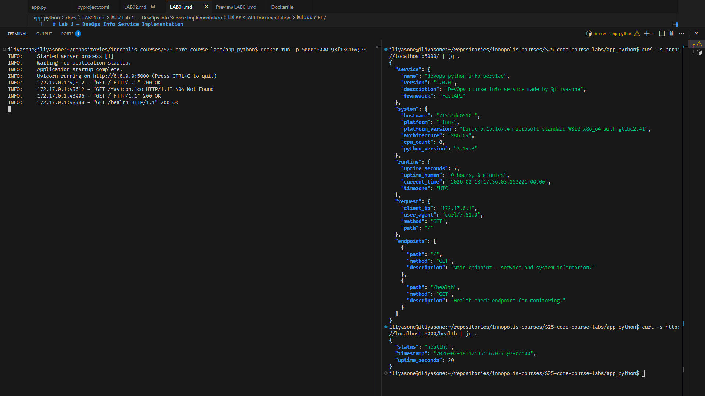

# Lab 2 — Docker Containerization


## 1. Docker Best Practices Applied

- 🔒 **Non-root user**: For security reasons.
If the container runs as root, any vulnerability in the app that allows attackers to gain code execution as root makes it unsafe and can compromise the host machine.

```Dockerfile
RUN useradd --create-home --shell /bin/bash appuser
USER appuser
```

- **Clever layer caching**: For memory and speed reasons (see №2).

- `.dockerignore`: Ignores unnecessary files (see №3).
```
.git
.gitignore
__pycache__
*.pyc
*.pyo
venv/
.venv/
.env
*.pem
secrets/
# 📝 Documentation
*.md
docs/
# 🧪 Tests
tests/
```

- **Use multi-stage build**:
It is true that for Python applications a multi-stage build does not do much, as we still need the Python executable to run the container; however, we do not need `uv`, so we can save some MB of space in the published image.

In the next chapter, I will compare those sizes.

## 2. Image Information & Decisions

### Base image `python:3.14-slim` 

It is a standard solution for a Python 3.14 app. `alpine` would be smaller, but may have some issues with wheel dependencies, and I am not sure if this project will use any of them; `slim` is a safe option. 

### Full image size

`iliyasone/devops-python-info-service:0.1` : 176.14 MB
`devops-python-info-service:no-multi-stages` : 229.28 MB

As you can see, using a multi-stage build reduces the total image size by around 50 MB. In **Appendix 1** I attach the `no-multi-stages` Dockerfile.

### Layer structure explanation

**Builder**

```Dockerfile
# Install Python
FROM python:3.14-slim AS builder
# Install uv
COPY --from=ghcr.io/astral-sh/uv:latest /uv /uvx /bin/
# Make app directory and work in it
WORKDIR /app
```
The first 3 stages are prerequisites.

```Dockerfile
# Install dependencies
RUN --mount=type=cache,target=/root/.cache/uv \
    --mount=type=bind,source=uv.lock,target=uv.lock \
    --mount=type=bind,source=pyproject.toml,target=pyproject.toml \
    uv sync --locked
```

Let's carefully examine what is happening here. This piece of code is taken from the [Astral Docker documentation page](https://docs.astral.sh/uv/guides/integration/docker/#intermediate-layers).

The first line creates a persistent cache directory shared between builds.

The next 2 lines temporarily bind the `uv.lock` and `pyproject.toml` files so that `uv sync` can use them to install dependencies.

**Runner**

```Dockerfile
FROM python:3.14-slim
RUN useradd --create-home --shell /bin/bash appuser
WORKDIR /app
```

The runner image does not have a `uv` dependency. This is the main — and, in fact, the only — benefit of the multi-stage setup in the current Dockerfile.

The next layers are simple:
```Dockerfile
# copy virtualenv
COPY --from=builder /app/.venv /app/.venv

# Copy only necessary application files
COPY app.py .

# 🔒 Switch to non-root user
USER appuser

CMD ["/app/.venv/bin/python", "app.py"]
```

We copy the `.venv` folder from the builder and use a non-root user to run the application.

### Optimization choices

The published image contains only one source code file, `app.py`, and a `.venv` folder with the Python executable. 


> 💡 It is interesting to compare what the image is made up of versus what is on GitHub: on GitHub we have everything **except** the `.venv` folder and executables. 
Docker Hub has only those.
Docker Hub perfectly complements this absent part.

## 3. Technical Analysis

1. Each Dockerfile layer provides a read-only snapshot of the difference between the current and previous step.

2. Reordering layers will increase the time needed to build an image and may also increase its size.

3. It is worth noting that a big benefit of a multi-stage build is **safety**, as we reduce the number of executables at runtime. Another significant security win is running as a non-root user.

4. Interestingly, `.dockerignore` is not very important here, as we are copying only a closed list of files (`app.py`, `uv.lock`, and `pyproject.toml`). All other files are not used at all. `.dockerignore` is a nice addition, but it is not impactful at all in current case.

## 4. Challenges & Solutions

Understanding `uv sync` was the main challenge. It not only installs dependencies, but may also install the current project as a module. This can be convenient, but requires extra care:
if `uv` installs the project into `.venv`, then we need the source code of all modules during that step, which means we need to copy all files before syncing. This is obviously not ideal, as it forces a full rebuild after any minor source code change.

The solution is to skip the project installation. We can use the `--no-install-project` flag, or simply omit the build system from `pyproject.toml`, resulting in a clean `.venv` containing only dependency packages.

[Astral's `uv` documentation for Docker](https://docs.astral.sh/uv/guides/integration/docker/#non-editable-installs) is excellent and straightforward. Most LLMs (Claude Opus 4.5/4.6, ChatGPT 5.2) make mistakes when interpreting the meaning of each step, so I had to consult the primary sources directly.

## 5. Build & Run Process
[iliyasone/devops-python-info-service](https://hub.docker.com/repository/docker/iliyasone/devops-python-info-service/general) @ DockerHub

### Complete terminal output from your build process

```bash
iliyasone@iliyasone:~/repositories/innopolis-courses/S25-core-course-labs/app_python$ docker build --no-cache .
[+] Building 137.2s (15/15) FINISHED                                                                                                                                        docker:default
 => [internal] load build definition from Dockerfile                                                                                                                                  0.0s
 => => transferring dockerfile: 659B                                                                                                                                                  0.0s
 => [internal] load metadata for ghcr.io/astral-sh/uv:latest                                                                                                                          0.5s
 => [internal] load metadata for docker.io/library/python:3.14-slim                                                                                                                   0.6s
 => [internal] load .dockerignore                                                                                                                                                     0.0s
 => => transferring context: 268B                                                                                                                                                     0.0s
 => CACHED FROM ghcr.io/astral-sh/uv:latest@sha256:4cac394b6b72846f8a85a7a0e577c6d61d4e17fe2ccee65d9451a8b3c9efb4ac                                                                   0.0s
 => [internal] load build context                                                                                                                                                     0.0s
 => => transferring context: 90B                                                                                                                                                      0.0s
 => CACHED [builder 1/4] FROM docker.io/library/python:3.14-slim@sha256:486b8092bfb12997e10d4920897213a06563449c951c5506c2a2cfaf591c599f                                              0.0s
 => [stage-1 2/5] RUN useradd --create-home --shell /bin/bash appuser                                                                                                                 1.0s
 => [builder 2/4] COPY --from=ghcr.io/astral-sh/uv:latest /uv /uvx /bin/                                                                                                              0.6s
 => [builder 3/4] WORKDIR /app                                                                                                                                                        0.1s
 => [builder 4/4] RUN --mount=type=cache,target=/root/.cache/uv     --mount=type=bind,source=uv.lock,target=uv.lock     --mount=type=bind,source=pyproject.toml,target=pyproject.t  130.4s
 => [stage-1 3/5] WORKDIR /app                                                                                                                                                        0.1s
 => [stage-1 4/5] COPY --from=builder /app/.venv /app/.venv                                                                                                                           1.4s 
 => [stage-1 5/5] COPY app.py .                                                                                                                                                       0.1s 
 => exporting to image                                                                                                                                                                1.7s 
 => => exporting layers                                                                                                                                                               1.7s 
 => => writing image sha256:93f1341649364b0649bf6f731ff8ffb440038a757acbb4ca6d3dfccacdd9f890                                                                                          0.0s 
```

### Terminal output showing container running & Terminal output showing container running & Terminal output from testing endpoints (curl/httpie)




# Appendix 1
`devops-python-info-service:no-multi-stages`
```Dockerfile
# Install uv
FROM python:3.14-slim
COPY --from=ghcr.io/astral-sh/uv:latest /uv /uvx /bin/
WORKDIR /app

# Install dependencies
RUN --mount=type=cache,target=/root/.cache/uv \
    --mount=type=bind,source=uv.lock,target=uv.lock \
    --mount=type=bind,source=pyproject.toml,target=pyproject.toml \
    uv sync --locked

RUN useradd --create-home --shell /bin/bash appuser

# Copy only necessary application files
COPY app.py .

# 🔒 Switch to non-root user
USER appuser

CMD ["/app/.venv/bin/python", "app.py"]
```