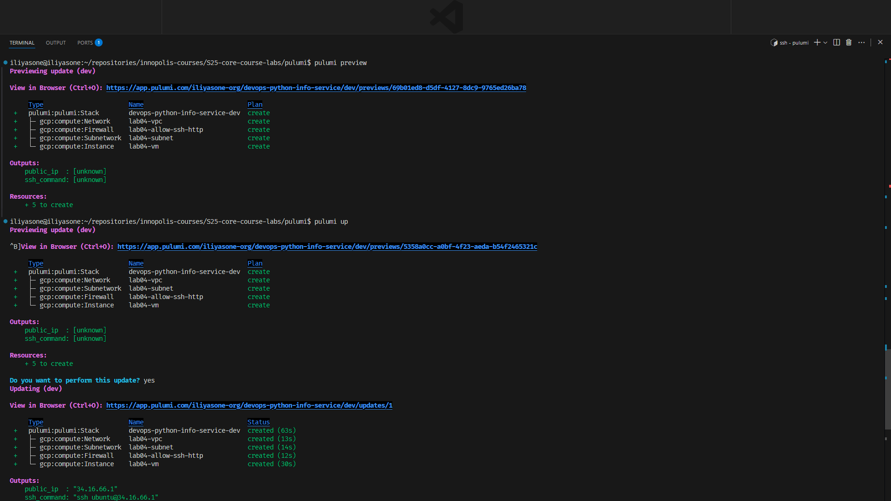
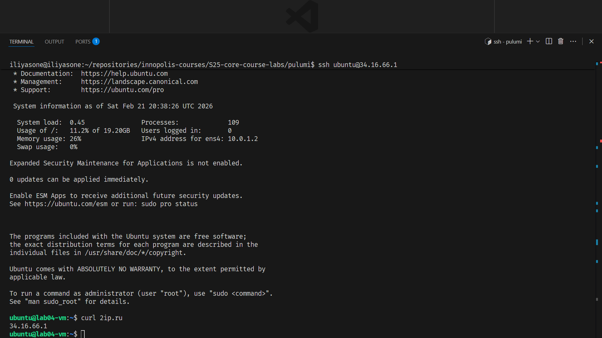
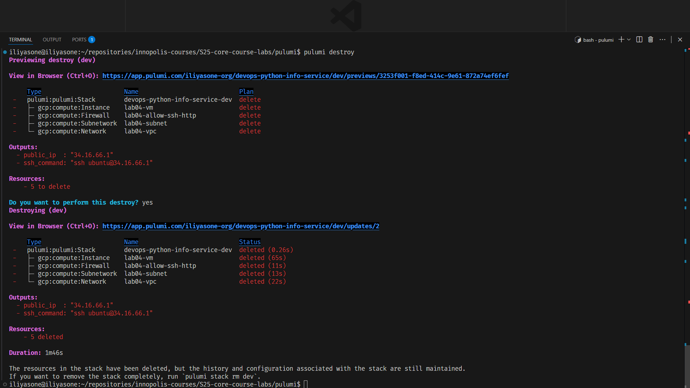
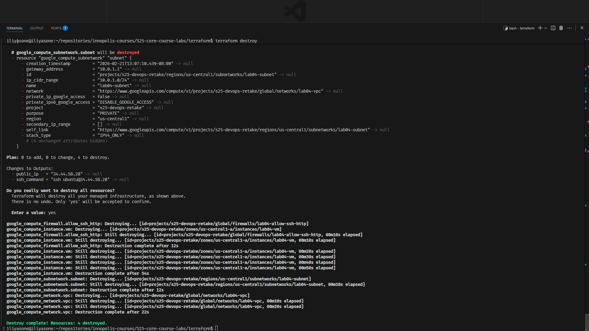

# Lab 4 — Infrastructure as Code (Terraform & Pulumi)

## 1. Cloud Provider & Infrastructure

I chose **Google Cloud Platform (GCP)** — free tier `e2-micro`, and I already had a service account set up from previous work.

| Parameter | Value |
|-----------|-------|
| Cloud provider | GCP |
| Instance type | `e2-micro` (1 shared vCPU, 1 GB RAM) |
| Region / Zone | `us-central1` / `us-central1-a` |
| OS | Ubuntu 22.04 LTS |
| Disk | 20 GB SSD |
| Cost | $0 |

Resources created (both Terraform and Pulumi):
- VPC network (`lab04-vpc`)
- Subnet (`lab04-subnet`, `10.0.1.0/24`)
- Firewall rule — TCP ports 22, 80, 5000 (`lab04-allow-ssh-http`)
- Compute instance (`lab04-vm`)


---

## 2. Terraform Implementation

**Terraform version:** 1.10.x

### Project structure

```
terraform/
├── main.tf          # Provider + all resources
├── variables.tf     # Variable declarations
├── outputs.tf       # Public IP + SSH command
├── terraform.tfvars # Actual values (gitignored)
└── .gitignore
```

### Key decisions

- Credentials are passed via a path variable pointing to `~/.config/gcloud/keys/my-service-account.json`
- Custom VPC instead of GCP's `default` network — better isolation, explicit firewall rules.
- SSH public key injected via instance metadata, no passwords.
- Outputs defined for public IP and a ready-to-paste SSH command.

### Terminal output

**`terraform plan`**
```
Plan: 4 to add, 0 to change, 0 to destroy.
```

**`terraform apply`** + SSH proof:


---

## 3. Pulumi Implementation

**Pulumi version:** 3.x  
**Language:** Python

### Key differences from Terraform

Instead of HCL config blocks, resources are just Python objects:

```python
vpc = gcp.compute.Network("lab04-vpc",
    name="lab04-vpc",
    auto_create_subnetworks=False,
)
```

Config is set via CLI and stored in `Pulumi.dev.yaml` (only the project ID is committed — credentials are passed via the `GOOGLE_CREDENTIALS` environment variable).

### Terminal output

**`pulumi preview`**



**SSH into Pulumi VM:**



**`pulumi destroy`:**



**`terraform destroy`:**



---

## 4. Terraform vs Pulumi Comparison

**Ease of learning:** Pulumi had a simpler setup — `pulumi new python`, add a package, write Python. Terraform requires learning HCL syntax and understanding its own module/variable system before you can do anything useful.

**State management:** Pulumi's backend connection to Pulumi Cloud is a genuinely good thing. With Terraform's local state, cloning the repo on another machine and running `terraform apply` would spawn duplicate resources because there's no shared state. Pulumi avoids this entirely by default.

**Code readability:** Python wins for me. HCL is fine for simple cases, but the moment you need any logic — loops, conditionals, dynamic values — HCL becomes awkward. In Python you just write Python.

**When to use which:**
- **Terraform** — team is ops-heavy and not comfortable with programming, or you need maximum ecosystem compatibility.
- **Pulumi** — team knows Python/TypeScript, infrastructure is complex enough to need real logic, or you want built-in secret encryption and remote state without extra setup.

---

## 5. Lab 5 Preparation & Cleanup

Both VMs have been destroyed.

For Lab 5, I will recreate the VM using Pulumi:

```bash
cd pulumi
pulumi up
```

This gives an identical VM in ~2 minutes. The public IP will change but everything else is the same.