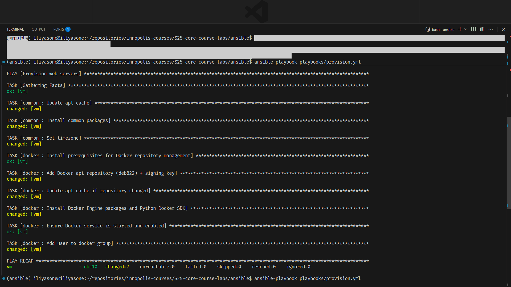
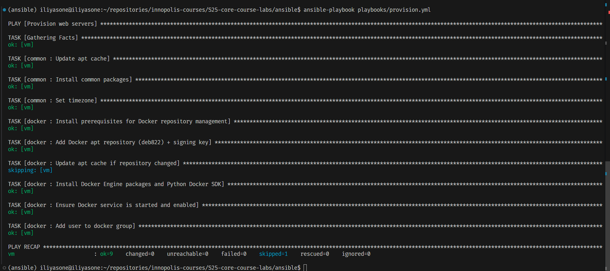

# Lab 5 - Provisioning Idempotency (Task 2.4)

## Provision Playbook

Playbook: `ansible/playbooks/provision.yml`  
Roles: `common`, `docker`

This section documents two consecutive runs of:

```bash
cd ansible
export GCP_SERVICE_ACCOUNT_FILE="$HOME/.config/gcloud/keys/my-service-account.json"
uv run ansible-playbook playbooks/provision.yml
```

## First Run Output

Screenshot: `app_python/docs/screenshots/11-provision-first-run.png`



Observed recap:

```text
lab04-vm : ok=11 changed=8 skipped=0 failed=0
```

Tasks with `changed` on first run:
- `docker : Install Docker Engine packages and Python Docker SDK`
- `docker : restart docker`
- `common : Update apt cache`
- `common : Install common packages`
- `common : Set timezone`
- `docker : Add Docker apt repository (deb822) + signing key`
- `docker : Update apt cache if repository changed`
- `docker : Add user to docker group`

Tasks with `ok` on first run (already in desired state):
- `Gathering Facts` (fact collection does not change system state)
- `docker : Install prerequisites for Docker repository management` (packages already present)
- `docker : Ensure Docker service is started and enabled` (service already started/enabled after install)

## Second Run Output

Screenshot: `app_python/docs/screenshots/12-provision-second-run.png`



Observed recap:

```text
lab04-vm : ok=9 changed=0 skipped=1 failed=0
```

On the second run, no task needed to modify the VM:
- Most tasks returned `ok` because desired state was already achieved in the first run.
- `docker : Update apt cache if repository changed` was `skipped` because `docker_repo.changed == false`.

## Why `ok=11` on the First Run Is Correct

In the recap, `ok` is the total count of successful tasks (both unchanged and changed).  
It does not mean tasks were skipped or that something is wrong.

In recap, `changed` is a subset of successful tasks:
- Total successful tasks: `ok=11`
- Of them, `changed=8`
- Remaining successful-without-change tasks: `3`

## What Makes These Roles Idempotent

The roles use declarative Ansible modules with target states:
- `apt: state=present`
- `deb822_repository: state=present`
- `service: state=started enabled=yes`
- `user: groups=docker append=yes`
- `timezone: name=UTC`

These modules compare current state vs desired state and only change when needed.  
That is why the first run converges the host, and the second run reports `changed=0`.
