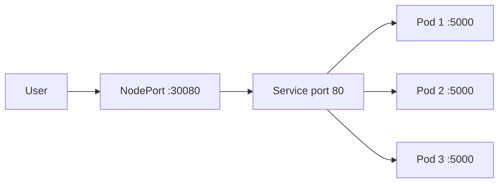
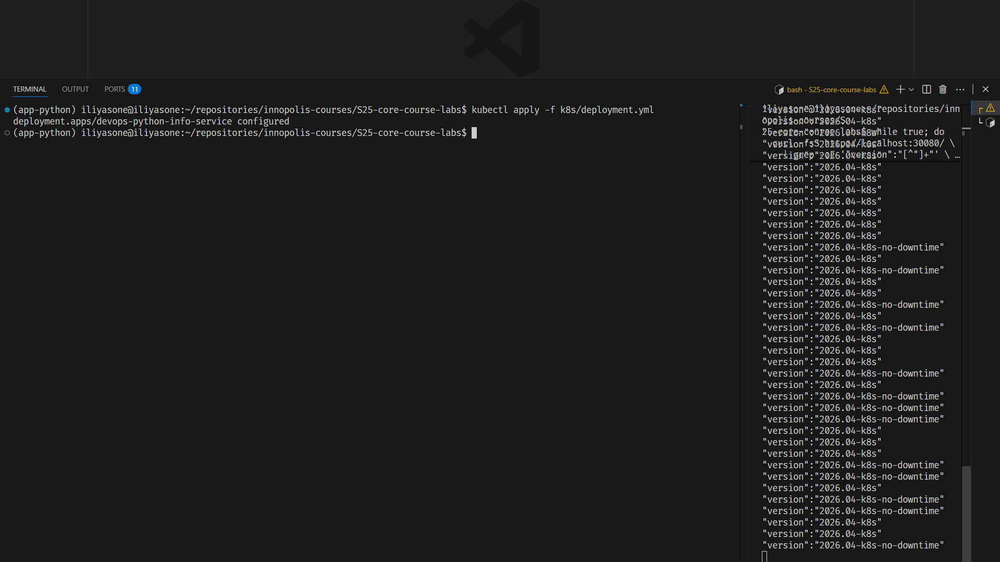

# Lab 9 — Kubernetes Fundamentals

## 1. Local Cluster Choice

I chose **kind** for this lab.

Reason: it runs Kubernetes nodes as Docker containers, starts quickly, and is
usually simpler for CI/CD than a VM-based local cluster. For this project this
is enough, because the app is already containerized and pushed to Docker Hub.

Local cluster config:

```text
k8s/kind-cluster.yml
```

It pins Kubernetes `v1.33.0` and maps host ports:

| Host port | Cluster port | Why |
|-----------|--------------|-----|
| `30080` | `30080` | NodePort access from localhost |

Commands:

```bash
kind create cluster --config k8s/kind-cluster.yml
kubectl cluster-info
kubectl get nodes -o wide
kubectl get namespaces
```

Tool versions:

```text
Client Version: v1.36.0
Kustomize Version: v5.8.1
kind v0.24.0 go1.22.6 linux/amd64
Docker server: 27.3.1
```

Cluster info:

```text
Kubernetes control plane is running at https://127.0.0.1:46508
CoreDNS is running at https://127.0.0.1:46508/api/v1/namespaces/kube-system/services/kube-dns:dns/proxy
```

Node:

```text
NAME                  STATUS   ROLES           AGE   VERSION   INTERNAL-IP
lab09-control-plane   Ready    control-plane   24s   v1.33.0   172.21.0.2
```

One small practical note: commands using `k8s/...` paths must be run from the
repository root. If I am already inside `k8s/`, the config path is just
`kind-cluster.yml`.

## 2. Architecture Overview



Required deployment:

- one `Deployment`
- three replicas by default
- one `NodePort` service
- app container listens on `5000`
- service exposes port `80` and maps it to container port `5000`
- external local access is through node port `30080`

Resource strategy:

| Resource | Request | Limit | Reason |
|----------|---------|-------|--------|
| CPU | `100m` | `500m` | Small FastAPI service, but enough room for spikes |
| Memory | `128Mi` | `256Mi` | Current app is lightweight and stateless |

This prevents one Pod from taking too much of the local cluster while still
giving the scheduler enough information to place replicas correctly.

## 3. Manifest Files

### `deployment.yml`

Main app deployment:

- image: `iliyasone/devops-python-info-service:latest`
- replicas: `3`
- rolling update: `maxSurge: 1`, `maxUnavailable: 0`
- non-root security context
- `/health` readiness, liveness, and startup probes
- resource requests and limits

I used `maxUnavailable: 0` because this is a small API and zero-downtime rolling
updates are easy to keep here.

### `service.yml`

Main app service:

- type: `NodePort`
- service port: `80`
- target port: named container port `http`
- node port: `30080`

I used a fixed `nodePort` so commands and screenshots are reproducible.

### `kind-cluster.yml`

Local cluster helper:

- cluster name: `lab09`
- node image: `kindest/node:v1.33.0`
- host port `30080` mapped to container port `30080`

## 4. Deployment Evidence

Commands required by the lab:

```bash
kubectl get all
kubectl get pods,svc -o wide
kubectl describe deployment devops-python-info-service
curl http://localhost:30080/health
```

Actual `kubectl get all`:

```text
NAME                                             READY   STATUS    RESTARTS   AGE
pod/devops-python-info-service-b8444c595-7ddx8   1/1     Running   0          43s
pod/devops-python-info-service-b8444c595-hnvw8   1/1     Running   0          43s
pod/devops-python-info-service-b8444c595-ls7qc   1/1     Running   0          43s

NAME                                 TYPE        CLUSTER-IP      EXTERNAL-IP   PORT(S)        AGE
service/devops-python-info-service   NodePort    10.96.163.179   <none>        80:30080/TCP   43s
service/kubernetes                   ClusterIP   10.96.0.1       <none>        443/TCP        72s

NAME                                         READY   UP-TO-DATE   AVAILABLE   AGE
deployment.apps/devops-python-info-service   3/3     3            3           43s

NAME                                                   DESIRED   CURRENT   READY   AGE
replicaset.apps/devops-python-info-service-b8444c595   3         3         3       44s
```

Actual `kubectl get pods,svc -o wide`:

```text
NAME                                             READY   STATUS    RESTARTS   AGE   IP           NODE
pod/devops-python-info-service-b8444c595-7ddx8   1/1     Running   0          44s   10.244.0.5   lab09-control-plane
pod/devops-python-info-service-b8444c595-hnvw8   1/1     Running   0          44s   10.244.0.6   lab09-control-plane
pod/devops-python-info-service-b8444c595-ls7qc   1/1     Running   0          44s   10.244.0.7   lab09-control-plane

NAME                                 TYPE        CLUSTER-IP      EXTERNAL-IP   PORT(S)        AGE   SELECTOR
service/devops-python-info-service   NodePort    10.96.163.179   <none>        80:30080/TCP   44s   app.kubernetes.io/component=api,app.kubernetes.io/name=devops-python-info-service
service/kubernetes                   ClusterIP   10.96.0.1       <none>        443/TCP        73s   <none>
```

Important `describe deployment` fields:

```text
Replicas:               3 desired | 3 updated | 3 total | 3 available | 0 unavailable
StrategyType:           RollingUpdate
RollingUpdateStrategy:  0 max unavailable, 1 max surge
Image:                  iliyasone/devops-python-info-service:latest
Limits:                 cpu: 500m, memory: 256Mi
Requests:               cpu: 100m, memory: 128Mi
Liveness:               http-get http://:http/health delay=15s timeout=2s period=10s
Readiness:              http-get http://:http/health delay=5s timeout=2s period=5s
Startup:                http-get http://:http/health delay=0s timeout=1s period=3s
```

Application check:

```text
$ curl -fsS http://localhost:30080/health
{"status":"healthy","timestamp":"2026-04-28T19:09:30.030908+00:00","uptime_seconds":16}

$ curl -fsS http://localhost:30080/ | rg -o '"version":"[^"]+"'
"version":"2026.04-k8s"
```

## 5. Operations Performed

Required part:

```bash
kubectl apply -f k8s/deployment.yml
kubectl apply -f k8s/service.yml
kubectl rollout status deployment/devops-python-info-service
kubectl get all
kubectl get pods,svc -o wide
kubectl describe deployment devops-python-info-service
```

Service access with kind:

```bash
kubectl port-forward service/devops-python-info-service 8080:80
curl http://localhost:8080/
curl http://localhost:8080/health
curl http://localhost:8080/metrics
```

Service access through NodePort:

```bash
curl http://localhost:30080/health
```

### Scaling and Updates

#### Scaling to 5 replicas

Declarative approach:

```bash
kubectl scale deployment/devops-python-info-service --replicas=5
kubectl rollout status deployment/devops-python-info-service
kubectl get pods -l app.kubernetes.io/name=devops-python-info-service -o wide
```

Expected state:

```text
deployment.apps/devops-python-info-service scaled
deployment "devops-python-info-service" successfully rolled out
devops-python-info-service-b8444c595-7ddx8   1/1   Running
devops-python-info-service-b8444c595-czxhs   1/1   Running
devops-python-info-service-b8444c595-hnvw8   1/1   Running
devops-python-info-service-b8444c595-ls7qc   1/1   Running
devops-python-info-service-b8444c595-mx9ck   1/1   Running
```

#### Rolling update

The cleanest demonstration is to change `APP_VERSION` in the manifest itself
and reapply, then watch a probe loop that prints the version returned by each
request. A simple "did the request succeed" loop only proves there was no
downtime; printing the version exposes the actual transition — old and new
Pods serving traffic at the same time, controlled by `maxSurge: 1` and
`maxUnavailable: 0`.

In one terminal, start a probe loop that hits `/` twice a second and extracts
the version field:

```bash
while true; do
  curl -fsS http://localhost:30080/ \
    | grep -oE '"version":"[^"]+"' \
    || echo "FAILED at $(date +%T)"
  sleep 0.5
done
```

In another terminal, edit `k8s/deployment.yml` to change `APP_VERSION` from
`2026.04-k8s` to `2026.04-k8s-no-downtime`, then:

```bash
kubectl apply -f k8s/deployment.yml
kubectl rollout status deployment/devops-python-info-service
kubectl rollout history deployment/devops-python-info-service
```

Observed output:

```text
deployment.apps/devops-python-info-service configured
deployment "devops-python-info-service" successfully rolled out
```

Probe loop output during the rollout:

```text
"version":"2026.04-k8s"
"version":"2026.04-k8s"
"version":"2026.04-k8s"
"version":"2026.04-k8s-no-downtime"
"version":"2026.04-k8s"
"version":"2026.04-k8s-no-downtime"
"version":"2026.04-k8s"
"version":"2026.04-k8s-no-downtime"
"version":"2026.04-k8s-no-downtime"
"version":"2026.04-k8s"
"version":"2026.04-k8s-no-downtime"
"version":"2026.04-k8s-no-downtime"
"version":"2026.04-k8s-no-downtime"
```

Two things matter in this output:

- the mix of old and new versions during the rollout shows the Service load
  balancing across whichever Pods are currently `Ready` — three Pods get
  replaced one at a time, so for a few seconds the Service has both old and
  new endpoints in rotation
- there is no `FAILED` line anywhere — every request got a 200, the only
  variable is which ReplicaSet served it

Screenshot of the live transition:



#### Rollback

```bash
kubectl rollout undo deployment/devops-python-info-service
kubectl rollout status deployment/devops-python-info-service
kubectl rollout history deployment/devops-python-info-service
```

Observed output:

```text
deployment.apps/devops-python-info-service rolled back
deployment "devops-python-info-service" successfully rolled out

REVISION  CHANGE-CAUSE
2         <none>
3         <none>

"version":"2026.04-k8s"
```

This works because Deployments keep ReplicaSet history. I keep
`revisionHistoryLimit: 5`, which is enough for the lab and avoids unlimited
old ReplicaSets. The `CHANGE-CAUSE` column is empty because I did not
`kubectl annotate` the change before applying — adding
`kubernetes.io/change-cause` would make the history more readable, but is not
required for rollback to work.

After the scaling and rollback demonstration I reapplied `deployment.yml` so the
live cluster matched the committed default again:

```text
deployment.apps/devops-python-info-service configured
deployment "devops-python-info-service" successfully rolled out
deployment.apps/devops-python-info-service   3/3     3     3
{"status":"healthy","timestamp":"2026-04-28T19:11:54.974888+00:00","uptime_seconds":58}
```

## 6. Production Considerations

Health checks:

- readiness probe keeps a new Pod out of Service endpoints until `/health` works
- liveness probe restarts a broken container
- startup probe gives the app time to boot before liveness checks can kill it

Security:

- image already runs as non-root from Lab 2
- Pod security context also sets non-root execution explicitly
- no secrets are stored in manifests

What I would improve for production:

- use immutable image tags instead of `latest`
- add `imagePullPolicy: IfNotPresent` for immutable tags
- add `PodDisruptionBudget`
- use `ClusterIP` behind Gateway API instead of public NodePort
- move config to ConfigMaps and secrets in future labs
- expose `/metrics` to Prometheus through a ServiceMonitor or scrape config