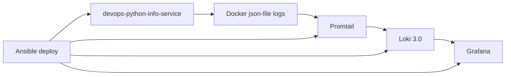

# Lab 07 - Observability & Logging

## Architecture

The monitoring stack runs from `monitor/docker-compose.yml`.



The Python app writes JSON logs to stdout/stderr. Docker stores the container
logs, Promtail discovers selected containers through the Docker socket, attaches
Loki stream labels, and sends the logs to Loki.

## Setup Guide

Start the stack locally:

```bash
cd monitor
export GRAFANA_ADMIN_PASSWORD="$(openssl rand -base64 32)"
docker compose up -d --build
```

Verify the main services:

```bash
docker compose ps
curl http://localhost:3100/ready
curl http://localhost:9080/targets
curl http://localhost:8000/health
curl http://localhost:3000/api/health
```

Grafana is available in the browser on port `3000`.

- Local URL: `http://localhost:3000`
- VM URL after Ansible deployment: `http://<vm-public-ip>:3000`
- Local default user: `admin`
- Local password: set `GRAFANA_ADMIN_PASSWORD` in the shell if you choose to run
  the stack locally.
- The VM firewall must allow TCP `3000`; the Terraform and Pulumi definitions
  in this repository include that rule.

For local testing, generate a temporary password in the shell:

```bash
cd monitor
export GRAFANA_ADMIN_PASSWORD="$(openssl rand -base64 32)"
docker compose up -d --build
```

Anonymous access is disabled. The dashboard and Loki data source are provisioned
automatically, so after login open **Dashboards** -> **Lab 07** ->
**Lab 07 - Loki Logs**.

## Loki Configuration

`monitor/loki/config.yml` configures Loki 3.0 as a single-node filesystem
deployment:

```yaml
schema_config:
  configs:
    - store: tsdb
      object_store: filesystem
      schema: v13

limits_config:
  retention_period: 168h
```

Important choices:

- `auth_enabled: false` keeps the lab stack simple.
- `store: tsdb` and `schema: v13` follow the Loki 3.0 recommendation
- `retention_period: 168h` keeps logs for 7 days.
- `compactor.retention_enabled: true` enables deletion of expired logs.

## Promtail Configuration

`monitor/promtail/config.yml` uses Docker service discovery and sends logs to
Loki:

```yaml
clients:
  - url: http://loki:3100/loki/api/v1/push

scrape_configs:
  - job_name: docker
    docker_sd_configs:
      - host: unix:///var/run/docker.sock
        filters:
          - name: label
            values:
              - logging=promtail
```

Promtail only scrapes containers with `logging=promtail`. The Lab 07 logging
stack services (`loki`, `promtail`, and `grafana`) and the Python app all have
this label so the lab stack can show logs from multiple containers.

The Python app service has these Docker labels in `monitor/docker-compose.yml`:

```yaml
labels:
  logging: "promtail"
  app: "devops-python-info-service"
  environment: "development"
```

Promtail relabels those Docker labels into Loki stream labels:

```yaml
relabel_configs:
  - source_labels:
      - __meta_docker_container_label_app
    target_label: app
  - source_labels:
      - __meta_docker_container_label_environment
    target_label: environment
```

The default app label is `app="devops-python-info-service"`. The compose file
also passes `APP_NAME=devops-python-info-service` to the Python app, so the Loki
stream label and the default JSON `app_name` field match. Loki 3.0 can use the
`app` stream label to derive `service_name`, so service identity stays in the
infrastructure layer.

## Grafana Configuration

Grafana is part of `monitor/docker-compose.yml` and uses two provisioning
mounts:

```yaml
volumes:
  - ./grafana/provisioning:/etc/grafana/provisioning:ro
  - ./grafana/dashboards:/var/lib/grafana/dashboards:ro
```

`monitor/grafana/provisioning/datasources/loki.yml` creates the Loki data
source automatically:

```yaml
datasources:
  - name: Loki
    type: loki
    url: http://loki:3100
    uid: loki
    isDefault: true
```

`monitor/grafana/provisioning/dashboards/default.yml` loads dashboard JSON from
`monitor/grafana/dashboards`. No browser-side setup is required.

## Application Logging

The Python application in `app_python/app.py` uses Python's standard `logging`
module with a custom `JSONFormatter`.

Each log line is emitted as one JSON object. The common fields are:

```json
{
  "timestamp": "2026-04-27T14:30:00Z",
  "level": "INFO",
  "logger": "devops-python-info-service",
  "app_name": "devops-python-info-service",
  "message": "http_request_finished"
}
```

Logged events:

- `app_startup`: emitted when the app starts, with host, port, debug mode, and
  app version.
- `http_request_started`: emitted before a request is processed, with method,
  path, and client IP.
- `http_request_finished`: emitted after a response is produced, with method,
  path, client IP, status code, and duration in milliseconds.
- `unhandled_exception`: emitted for uncaught exceptions, including exception
  traceback and request context.

Application settings:

| Variable | Default | Used for |
| --- | --- | --- |
| `APP_NAME` | `devops-python-info-service` | API service name and JSON `app_name` field |
| `APP_VERSION` | `2026.04` | API service version and startup log context |
| `LOG_LEVEL` | `INFO` | Logging verbosity |

## LogQL Examples

All logs from the Python app:

```logql
{app="devops-python-info-service"}
```

Parse JSON and filter request logs:

```logql
{app="devops-python-info-service"} | json | method="GET"
```

Filter by log level:

```logql
{app="devops-python-info-service"} | json | level="INFO"
```

Request/log rate:

```logql
rate({app="devops-python-info-service"}[1m])
```

Error logs:

```logql
{app="devops-python-info-service"} | json | level="ERROR"
```

## Dashboard

The provisioned dashboard is `Lab 07 - Loki Logs`. It contains the four required
panels:

| Panel | Visualization | LogQL |
| --- | --- | --- |
| Recent Application Logs | Logs | `{app=~"devops-.*"}` |
| Request Log Rate by App | Time series | `sum by (app) (rate({app=~"devops-.*"}[1m]))` |
| Error Logs | Logs | `{app=~"devops-.*"} | json | level="ERROR"` |
| Log Level Distribution | Pie chart | `sum by (level) (count_over_time({app=~"devops-.*"} | json [5m]))` |

Generate sample traffic before opening the dashboard:

```bash
for i in {1..20}; do curl -fsS http://localhost:8000/ > /dev/null; done
for i in {1..20}; do curl -fsS http://localhost:8000/health > /dev/null; done
```

## Production Configuration

Production-oriented settings included in the compose and Ansible deployment:

- Grafana anonymous access is disabled.
- Grafana admin credentials are environment/Ansible Vault variables, not
  hard-coded into application code.
- Loki retention is `168h` with the compactor enabled.
- Loki and Grafana have health checks.
- Loki, Promtail, Grafana, and the local app compose service have CPU and memory
  resource constraints.
- Promtail only scrapes containers labeled `logging=promtail`.

## Ansible Automation

Lab 07 monitoring deployment is automated by `ansible/roles/monitoring`.

The role:

- creates `/opt/lab07-monitoring`
- templates Loki, Promtail, Grafana provisioning, and Docker Compose files
- starts the stack with `community.docker.docker_compose_v2`
- waits for Loki and Grafana ports
- verifies `http://127.0.0.1:3100/ready`
- verifies `http://127.0.0.1:3000/api/health`

Entrypoints:

```bash
cd ansible
uv run ansible-playbook playbooks/deploy-monitoring.yml
uv run ansible-playbook playbooks/deploy.yml
uv run ansible-playbook playbooks/site.yml
```

`playbooks/deploy.yml` deploys both the app and monitoring stack. GitHub Actions
runs `playbooks/site.yml` after successful app image publishing, so every
production push converges the app, Loki, Promtail, and Grafana together.
The production Grafana password is stored as `grafana_admin_password` in the
encrypted `ansible/group_vars/all.yml` vault. The monitoring role fails before
deployment if that password is missing, shorter than 16 characters, or equal to
`admin`.

The app deployment template adds these labels to the application container:

```yaml
labels:
  logging: "promtail"
  app: "devops-python-info-service"
  environment: "production"
```

That makes the production app logs visible to the deployed Promtail instance.

## Testing

Local validation:

```bash
cd monitor
docker compose config --quiet
docker compose up -d --build
docker compose ps
curl -fsS http://localhost:3100/ready
curl -fsS http://localhost:9080/targets
curl -fsS http://localhost:3000/api/health
curl -fsS http://localhost:8000/health
```

Ansible validation:

```bash
cd ansible
uv run ansible-playbook -i inventory/hosts.ini --syntax-check playbooks/deploy-monitoring.yml
uv run ansible-playbook -i inventory/hosts.ini --syntax-check playbooks/deploy.yml
uv run ansible-playbook -i inventory/hosts.ini --syntax-check playbooks/site.yml
```

## Challenge: Labels vs Log Records

💡 One thing that clicked for me during this lab is the separation between Loki labels and JSON log fields — they serve different purposes and are owned by different layers.

Loki labels are infrastructure-owned metadata. The `app` and `environment` labels live in Docker Compose, get promoted by Promtail into Loki stream labels, and that's what Loki indexes for fast stream selection. The application has no say in this — it's decided at deployment time.

JSON log fields are application-owned runtime detail. Fields like `method`, `path`, `status_code`, `duration_ms`, and `exception` only exist because the app knows those values at the moment it writes the log line. Loki doesn't index them — they're parsed on the fly with `| json` in LogQL queries.

I keep `APP_NAME` and the Docker label `app` set to the same value (`devops-python-info-service`) by default so that raw JSON logs stay self-describing even outside Grafana, while Loki indexing remains controlled by the infrastructure layer.

