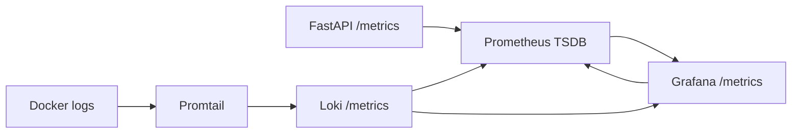

# Lab 8 — Metrics & Monitoring with Prometheus

## Architecture



Metrics answer "how much and how fast"; logs answer "what happened". This stack
keeps both: Prometheus stores low-cardinality time series, while Loki stores
structured container logs from Lab 7.

## Application Instrumentation

The app exposes `/metrics` through `prometheus-fastapi-instrumentator`, giving
request rate, errors, request duration histograms, and active request gauges.
Two service-specific metrics were added in `app_python/app.py`:

| Metric | Type | Why |
|--------|------|-----|
| `devops_info_endpoint_calls_total` | Counter | Counts endpoint usage without high-cardinality labels |
| `devops_info_system_collection_seconds` | Histogram | Tracks the cost of collecting host/runtime data |

## Prometheus Configuration

Prometheus is configured in `monitor/prometheus/prometheus.yml` and templated by
Ansible from `ansible/roles/monitoring/templates/prometheus.yml.j2`.

| Job | Target | Purpose |
|-----|--------|---------|
| `prometheus` | `localhost:9090` | Self-scrape |
| `loki` | `loki:3100` | Loki health and runtime metrics |
| `grafana` | `grafana:3000` | Grafana process metrics |
| `app` | `app-python:5000` locally, `host.docker.internal:5000` via Ansible | FastAPI RED metrics |

The scrape interval and evaluation interval are `15s`. Prometheus data is
persisted in `prometheus-data` with retention capped at `15d` and `10GB`.

## Dashboard Walkthrough

The provisioned dashboard is `monitor/grafana/dashboards/lab08-metrics.json`.
Ansible deploys the same dashboard to Grafana as `lab08-metrics.json`.

| Panel | Query |
|-------|-------|
| Request Rate | `sum by (handler) (rate(http_requests_total[5m]))` |
| Error Rate | `sum(rate(http_requests_total{status=~"5..|5xx"}[5m]))` |
| Request Duration p95 | `histogram_quantile(0.95, sum by (le, handler) (rate(http_request_duration_seconds_bucket[5m])))` |
| Active Requests | `http_requests_in_progress` |
| Application Uptime | `up{job="app"}` |
| Status Code Distribution | `sum by (status) (rate(http_requests_total[5m]))` |
| Request Duration Heatmap | `sum by (le) (rate(http_request_duration_seconds_bucket[5m]))` |
| System Info Collection Duration | `histogram_quantile(0.95, rate(devops_info_system_collection_seconds_bucket[5m]))` |

## PromQL Examples

```promql
up
```

Shows whether every scrape target is reachable.

```promql
sum by (handler) (rate(http_requests_total[5m]))
```

Shows request rate per route.

```promql
sum(rate(http_requests_total{status=~"5..|5xx"}[5m]))
```

Shows server error rate.

```promql
histogram_quantile(0.95, sum by (le, handler) (rate(http_request_duration_seconds_bucket[5m])))
```

Shows p95 latency per route.

```promql
sum by (status) (rate(http_requests_total[5m]))
```

Shows response distribution by status class.

```promql
rate(process_cpu_seconds_total{job="app"}[5m]) * 100
```

Shows application CPU consumption trend.

## Production Setup

The Compose and Ansible deployments include:

- health checks for Loki, Grafana, Prometheus, and the app
- persistent volumes for Loki, Grafana, and Prometheus
- Prometheus retention limits: `15d` and `10GB`
- resource limits: Prometheus `1 CPU / 1G`, Loki `1 CPU / 1G`, Grafana `0.5 CPU / 512M`, app `0.5 CPU / 256M`
- Grafana provisioning for both Loki and Prometheus data sources
- automatic provisioning for the Lab 7 logs dashboard and Lab 8 metrics dashboard

## Ansible Automation

The monitoring role now deploys the complete observability stack:

```bash
cd ansible
uv run ansible-playbook playbooks/deploy.yml
```

For monitoring-only convergence:

```bash
cd ansible
uv run ansible-playbook playbooks/deploy-monitoring.yml
```

Important variables are in `ansible/roles/monitoring/defaults/main.yml`:

- `monitoring_prometheus_version`
- `monitoring_prometheus_scrape_interval`
- `monitoring_prometheus_retention_time`
- `monitoring_prometheus_retention_size`
- `monitoring_prometheus_targets`
- `monitoring_prometheus_required_jobs`

The role templates `docker-compose.yml`, `prometheus.yml`, Grafana data sources,
and dashboards, starts the stack with `community.docker.docker_compose_v2`, then
checks Loki, Grafana, Prometheus, and required Prometheus target health.

## Testing Results

Local app checks:

```bash
cd app_python
uv run ruff format
uv run ruff check
uv run pyright
uv run pytest
```

Monitoring checks:

```bash
cd monitor
docker compose up -d
docker compose ps
curl http://localhost:9090/-/healthy
curl http://localhost:9090/api/v1/targets?state=active
```

Expected UI evidence:

- Prometheus targets page has `prometheus`, `loki`, `grafana`, and `app`
- Grafana has `Loki` and `Prometheus` data sources
- Grafana folder `Observability` contains both Lab 7 logs and Lab 8 metrics dashboards

## Challenges & Solutions

The app and monitoring stack are separate Ansible Compose projects in production.
Prometheus therefore scrapes the published app port through
`host.docker.internal`, with `host-gateway` injected into the Prometheus
container. This keeps the web app role independent while still allowing the
monitoring role to scrape app metrics.
